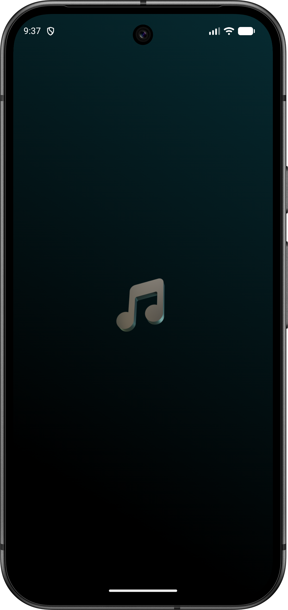
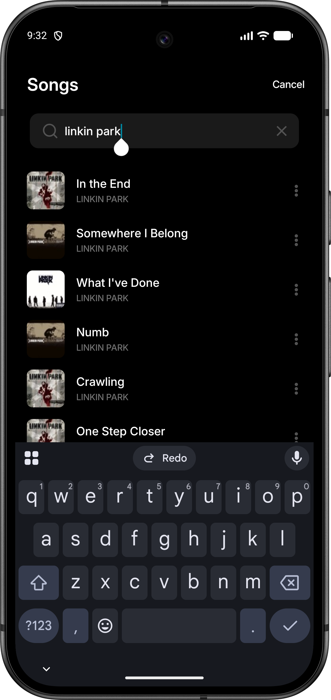
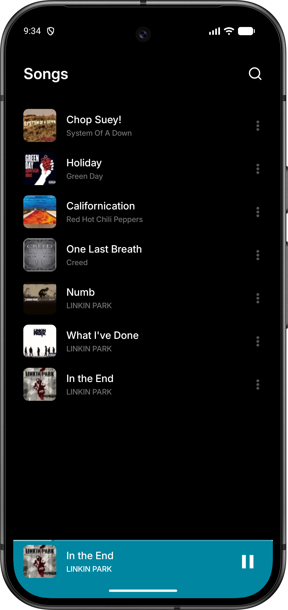
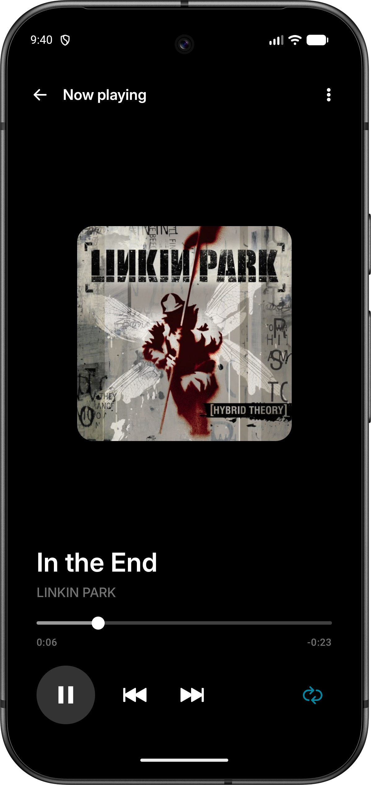
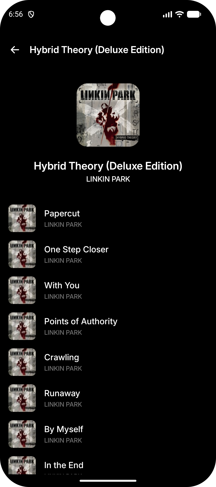
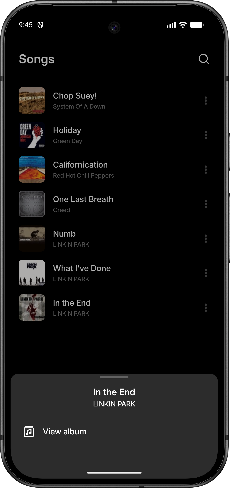
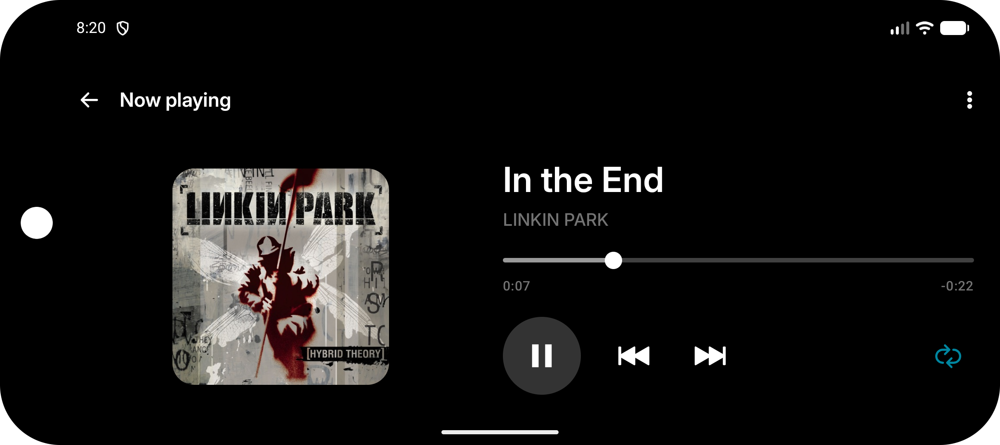
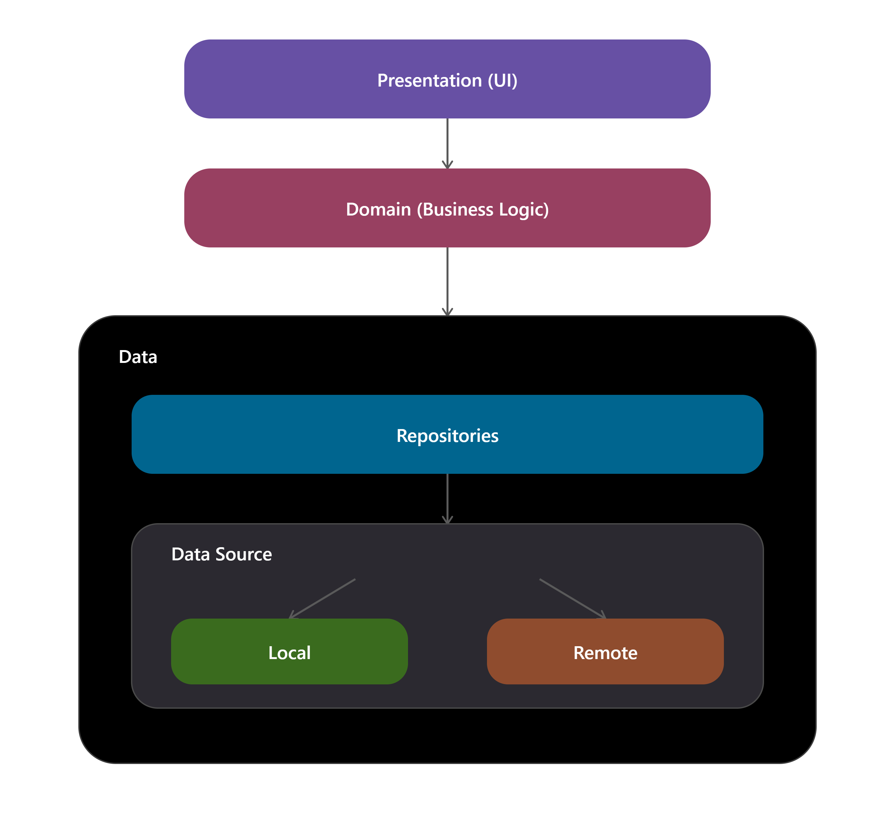

# 🎵 Moises Android Challenge

**Moises Android Challenge** is a modern Android application that allows you to explore, search, and play songs using the [iTunes API](https://developer.apple.com/library/archive/documentation/AudioVideo/Conceptual/iTuneSearchAPI/index.html). The project was developed with a focus on current technologies, following the best practices for Android development.

---

## 📸 Screenshots

  
  
  
  
  
  

  

---

## 🏗️ Architecture

The project uses the **MVVM (Model-View-ViewModel)** architecture combined with **Clean Architecture** principles, ensuring a clear separation of concerns, ease of maintenance, and testability.

- **Data**: Implementation of repositories, data sources (Remote and Local), mapping of data models (DTOs), and media player controller.
- **Domain**: Business rules, domain models, and Use Cases.
- **Presentation**: Declarative UI with Jetpack Compose, ViewModels for state management, and UI State.
- **Core**: Shared components, design system, utilities, and base classes for other layers.

  

---

## 🛠️ Technologies and Dependencies

### Environment & Configuration
- **Android SDK**: `compileSdk 37`, `minSdk 26`, `targetSdk 36`
- **Java**: Version 21
- **Gradle**: Android Gradle Plugin (AGP) 9.3.1 (Gradle 9.5.0)

### Core
- **Kotlin**: Modern and concise programming language.
- **Coroutines & Flow**: Asynchronous programming and reactive data streams.
- **Hilt (Dagger)**: Dependency injection for Android.

### UI & UX
- **Jetpack Compose**: Modern toolkit for building native UI.
- **Material 3**: Google's design system for modern interfaces.
- **Navigation 3**: Type-safe and decoupled navigation between screens.
- **Coil**: Efficient image loading optimized for Compose.
- **Splash Screen API**: Native support for splash screens.

### Data, Media & Networking
- **Retrofit & OkHttp**: REST API consumption and HTTP request management.
- **Room**: Local database (SQLite) with robust abstraction.
- **Paging 3**: Efficient data pagination from API and local database.
- **Media3 (ExoPlayer)**: Powerful and extensible media player for audio playback.
- **Kotlinx Serialization**: JSON data serialization.

---

## 📝 Commit Patterns

The project adopts the **Conventional Commits** standard in conjunction with **Gitmojis** to maintain a readable and organized change history.

### Commit Types:
- `✨ feat`: Introduction of new features.
- `🐛 fix`: Bug fixes.
- `♻️ refactor`: Code changes that neither fix bugs nor add features.
- `✅ test`: Adding or correcting tests.
- `🔧 chore`: Maintenance tasks, build configurations, refactoring structures, etc.
- `📦 build`: Changes affecting the build system or external dependencies.
- `📝 docs`: Documentation changes.
- `🎨 style`: Changes that do not affect the meaning of the code (white-space, formatting, missing semi-colons, etc).

### Example:
`✨ feat(song): add delay to recentlyPlayedSongs flow`

---

## 🌿 Branching Strategy (Gitflow)

The project's development followed a structured branching model inspired by **Gitflow** to organize the implementation phases. The following branches were used throughout the project:

- `setup/project`: Initial project configuration, dependencies and structure.
- `setup/design-system`: Definition of typography, colors, shapes, and base components.
- `feature/domain`: Implementation of models, repositories interfaces, and use cases.
- `feature/data`: Implementation of local/remote data sources, DTOs, and mappers.
- `feature/presentation`: Development of the UI using Jetpack Compose and ViewModels.
- `fix/ui-tweaks`: Adjustments and bug fixes in the user interface and responsiveness.
- `test/unit-tests`: Addition of unit tests for the domain, data, and presentation layers.
- `test/ui-tests`: Implementation of UI and integration tests.

---

## 🧪 Testing
The project has a solid testing foundation to ensure code quality:
- **Unit Tests**: JUnit 4, Kotest, MockK, Mockito, and Truth.
- **Network Tests**: MockWebServer for mocking API responses.
- **Integration Tests**: Robolectric for testing Android framework on the JVM.
- **UI Tests**: Espresso and Compose UI Test.

---

## 🚀 How to Run

1. Clone the repository.
2. Open the project in Android Studio.
3. Sync Gradle and build the project.
4. Run the application on an emulator or physical device.

---

## 📥 Download APK

You can download the latest version of the application using the link below:

---

Developed by [Bruno Felix](https://github.com/brunofelix7) 🚀
